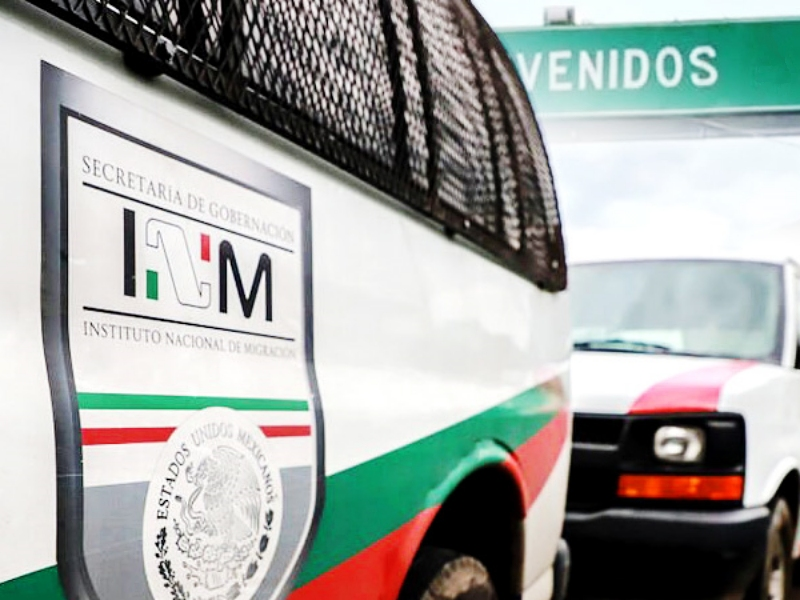

# Адвокатская помощь по освобождению из миграционной тюрьмы

***Наша команда экспертов специализируется на освобождении из-под заключения и защите прав человека.***

Мексика является популярным направлением для мигрантов, которые ищут лучшей жизни или беженства. Однако, при незаконном пересечении границы или нарушении других миграционных правил, лица могут быть арестованы и помещены под стражу. В таких ситуациях не обойтись без помощи адвоката.

Юристы, специализирующиеся на миграционном праве, обладают глубокими знаниями и опытом в этой области. Они понимают сложности миграционного процесса и могут предоставить эффективную защиту своим клиентам. Они знают, какие права имеют задержанные мигранты и какие процедуры должны быть соблюдены при их задержании. Наши консультанты наработали огромную практику в области миграционного права и ежедневно продолжают предоставлять квалифицированную юридическую помощь.

> *
У вас возникли проблемы с миграционными правилами на территории Мексики? Не беспокойтесь, мы здесь, чтобы помочь вам!
*

В обязательном порядке группой юристов при поддержке соответствующих служб, проводится подробный анализ дела, изучаются все доказательства и уже по итогам, в суде, адвокаты представляют интересы ответчика. Они также позаботятся о том, чтобы подопечный был осведомлен о своих правах и процедурах, для принятия им впоследствии обоснованных решений.

Ко всему прочему, наша команда также поможет разобраться с миграционным статусом и предложит возможные пути легализации. Мы знаем, какие документы и процедуры необходимы для получения различных видов разрешений на пребывание или гражданства. С нами при желании можно не только освободиться из-под заключения, но и получить легальный статус на территории Мексики.

> *
Как и любая работа, адвокатские услуги имеют свою цену. Однако, в случае задержания мигранта, доступ к квалифицированной юридической помощи может сыграть решающую роль в исходе дела.
*

Не оставайтесь один на один с миграционными проблемами! Обратитесь к нам сегодня и получите профессиональную юридическую помощь, которая поможет вам освободиться из-под заключения и защитить ваши права. Наша команда юристов готова помочь вам преодолеть любые трудности и обеспечить вам справедливый процесс.
