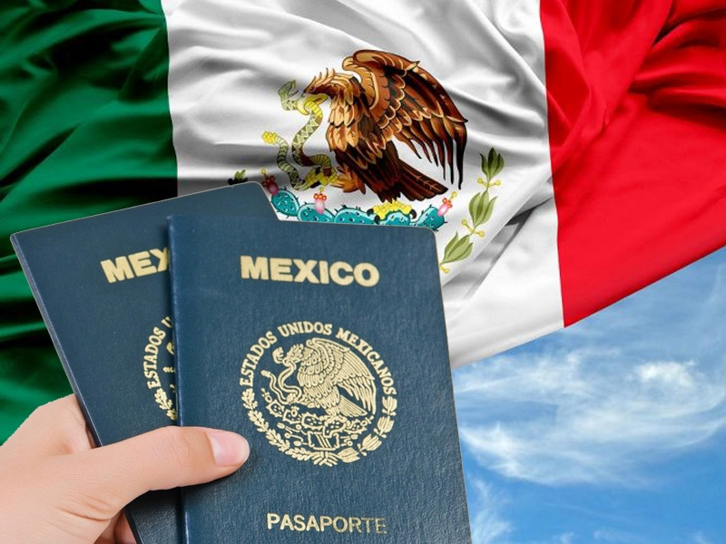

# Процесс натурализации для граждан, имеющих вид на жительство

***Процесс натурализации в Мексике является важным шагом для иностранных граждан, желающих стать полноправными членами этой страны.***

Один из основных офисов, отвечающих за подачу документов на натурализацию в Мексике, является Секретариат по внешним делам (SRE), или Secretaría de Relaciones Exteriores. Этот офис отвечает за рассмотрение и обработку заявлений иностранных граждан, желающих получить мексиканское гражданство.

> *
Натурализация предоставляет возможность получить мексиканское гражданство и все связанные с ним права и привилегии.
*

Для начала процесса натурализации в Мексике иностранный гражданин должен соответствовать определенным требованиям. Одним из основных критериев является законное проживание в Мексике не менее пяти лет (в отдельных случаях не менее двух лет). Также необходимо подтвердить знание испанского языка и мексиканской культуры, что обычно осуществляется через специальные экзамены.

Для начала процесса натурализации иностранный гражданин должен обратиться в Секретариат по внешним делам и подать заявление на натурализацию. Заявление должно быть подкреплено необходимыми документами, такими как паспорт, действительная виза, миграционные документы и другие документы, подтверждающие легальное пребывание в стране.

После подачи заявления иностранный гражданин будет приглашен в SRE для прохождения экзамена и интервью, где ему будет задан ряд вопросов о его личных данных, образовании, работе и семейном статусе. Если заявитель не справится с заданиями, ему будет назначена повторная встреча.

> *
Подготовка к экзамену на гражданство Мексики увеличит шансы на успешное прохождение. Формат обучения каждый выбирает себе сам, будь то уроки с преподавателем по готовой программе, или самостоятельное штудирование информации в интернете
*

В результате положительной сдачи тестов, включится «режим ожидания», в ходе которого сотрудниками спец.служб будет проведена проверка всех полученных данных претендента на гражданство, включая историю криминального прошлого и связей с террористическими организациями. На практике, ожидание ответа от SRE после успешной сдачи экзамена может длиться от десяти календарных месяцев и дольше.

После завершения всех этапов, иностранный гражданин должен пройти церемонию натурализации, в ходе которой ему будет вручена карта натурализации и мексиканский паспорт. С этого момента он становится полноправным гражданином Мексики и может пользоваться всеми правами и привилегиями, предоставляемыми мексиканским гражданством.

В целом, для одних, пройти самостоятельно весь процесс натурализации в Мексике не вызывает труда, для других – он кажется сложным. Учитывая, что сами основания для получения гражданства бывают разные, как следствие будут отличаться, и сроки до подачи на натурализацию, и пакет документов и прочие моменты. Как заранее подготовить себя и избежать лишних ожиданий и затрат? По этим вопросам наши юристы дают исчерпывающую консультацию. Позаботьтесь на будущее, обратитесь за индивидуальной консультацией сразу, после получения временной или постоянной резиденции!
