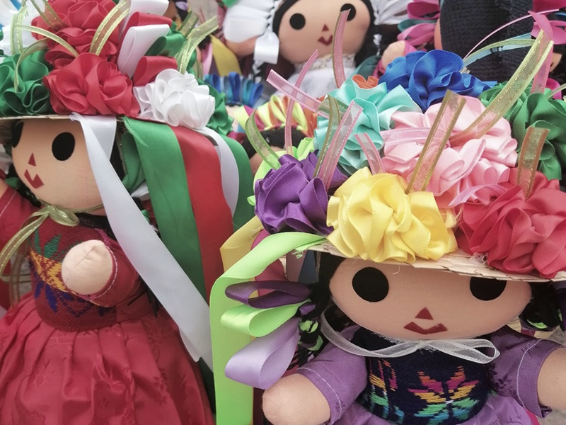

# ПМЖ по ребенку-мексиканцу

***Получение постоянного вида на жительство в Мексике по ребенку, рожденному на территории страны, является важной темой для многих семей, которые проживают или планируют проживать в Мексике.***

В данном посте мы рассмотрим процесс получения постоянного вида на жительство для ребенка, рожденного на территории Мексики, и необходимые документы для этого.

> *
Согласно мексиканскому законодательству, ребенок, рожденный на территории Мексики, автоматически приобретает гражданство этой страны.
*

Однако, чтобы его родителям получить постоянное вид на жительство, необходимо выполнить определенные требования.

Первым шагом является оформление свидетельства о рождении ребенка. Это документ, подтверждающий факт рождения и гражданство ребенка. Для получения свидетельства о рождении необходимо обратиться в местный регистрационный офис и предоставить следующие документы: свидетельство о браке (если применимо), паспорт родителей или удостоверение личности, а также другие документы, которые могут потребоваться в зависимости от конкретной ситуации.

После получения свидетельства о рождении ребенка, родители могут приступить к оформлению постоянного вида на жительство для себя. Для этого необходимо обратиться в Национальную миграционную службу (INM) и подать заявление. В заявлении необходимо указать личные данные ребенка и его родителей, а также предоставить копии всех необходимых документов.

Копии документов, которые могут потребоваться для оформления постоянного вида на жительство, включают, но не ограничиваются следующими: свидетельство о рождении ребенка, паспорта родителей (удостоверения личности), данные о месте проживания на территории Мексики (это может быть счет за воду или электричество), мед.справка от врача-педиатра, а также другие документы, которые могут потребоваться в зависимости от конкретной ситуации.

После подачи заявления и предоставления всех необходимых документов, INM проведет проверку и рассмотрение заявления. В случае одобрения, родители получают ПМЖ по ребенку. Следующим шагом может стать оформление постоянной резиденции (перманенте) на своих несовершеннолетних детей, рожденных за пределами Мексики.

> *
Важно отметить, что процесс получения постоянного вида на жительство может занять некоторое время, и необходимо быть терпеливым.
*

Также стоит учесть, что законы и требования могут изменяться со временем, поэтому рекомендуется обратиться за консультацией к юристу или специалисту в области иммиграции для получения актуальной информации.

Подытожим: получение постоянного вида на жительство в Мексике по ребенку, рожденному на территории страны, возможно при выполнении определенных требований и предоставлении необходимых документов. Это важный процесс, который позволяет ребенку, а также членам его семьи иметь правовой статус и доступ к различным благам и услугам в Мексике.
