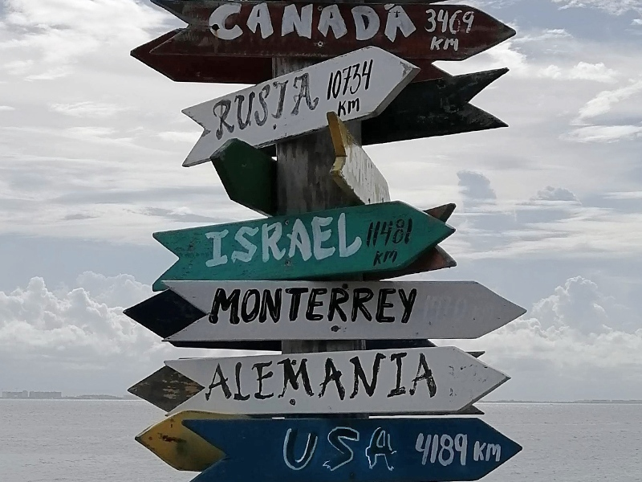

# ВНЖ по урегулированию

***«Программа урегулирования» в Мексике предоставляет возможность иностранным гражданам легализовать свое положение в стране на определенный период времени.***

Программа регулирования статуса миграции впервые заработала 30 июня 2004 года. Цель программы заключается в установлении процедуры, согласно которой все иностранные граждане, проживающие в Мексике без действующих или правильно оформленных миграционных документов, могут запросить статус резидента, который обеспечивает им больше прав человека и льгот, доступных местным жителям.

> *
Если вы уже были в Мексике как турист с 2015 по 2021 год, то вы можете приехать вновь, просрочить пребывание на один или более дней и на этом основании получить временное вид на жительство (ВНЖ) на 4 года.
*

Для получения ВНЖ по программе урегулирования необходимо предоставить определенный пакет документов, включающий паспорт, квиток оплаты за воду или свет в качестве подтверждения места жительства, заявление и другие необходимые документы. Также требуется оплата государственной пошлины.

Получение ВНЖ в Мексике по программе урегулирования имеет свои преимущества. Во-первых, это позволяет легализовать свое положение в стране и находиться там легально. Во-вторых, это открывает двери для поиска работы или учебы в Мексике. Кроме того, ВНЖ может быть продлен или преобразован в постоянный вид на жительство (ПМЖ), а затем можно подать на гражданство.

Однако, следует учитывать, что программа урегулирования в Мексике имеет свои требования и ограничения. Например, срок пребывания по ВНЖ может быть ограничен и, конечно, иностранный гражданин обязан соблюдать законы страны и не нарушать мексиканское законодательство.

> *
Программа урегулирования действует не всегда и в любой момент может, как прекратить, так и возобновить свою работу!
*

Кроме того, далеко не во всех офисах ИНМ с ней работают, а там где работают, могут быть длительные ожидания на прием и обработку документов в виду большой нагрузки. За актуальной информацией и помощью в получении резиденции, обратитесь к нашим специалистам в области миграционных вопросов в Мексике.

В целом, получение ВНЖ по программе урегулирования в Мексике является достаточно простым и доступным процессом для иностранных граждан. Если вы уже были в Мексике как турист и хотите легализовать свое положение, то это отличная возможность насладиться красотами и гостеприимством Мексики на более длительный срок.
